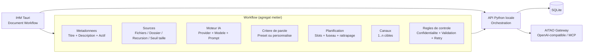

# PRD — AuriPostao
**Nom du Projet :** AuriPostao
**Entité :** Aurica Circular / 樂循永續
**Auteur :** Philippe 江樂田
**Licence :** AGPL (Affero General Public License)
**Statut :** Draft v0.2 (Correction Vision & Stack)

---

## 1. Vision du Produit
AuriPostao est une application légère, auto-hébergée et sous licence AGPL, conçue pour générer et programmer/publier automatiquement un contenu court sur des réseaux sociaux décentralisés et/ou par email, à partir de sources personnelles, en utilisant exclusivement un modèle de langage local (LLM) via MCP Server, openai-compatible ou Ollama.
On lui donne une ou plusieurs sources en entrée, il est capable de livrer un post court à destination des RS ou d'une messagerie instantanée en plusieurs langage (fr, en, zh-TW) soit avec une validation humaine soit automatiquement avec planification.

**Valeurs clés :**
- **Souveraineté :** 100% local, aucune donnée ne transite par un cloud tiers.
- **Éthique :** Licence AGPL pour les dev ajoutés afin garantir que les améliorations restent libres.
- **Sobriété :** Optimisé pour l'IA locale, économisant 90% de CO2 vs les API cloud.

---

## 2. Architecture & Stack Technique
- **Core Logic :** Python 3.14+ (Gestion des workflows, parsing des sources, APIs sociales).
- **Interface (GUI) :** **Tauri** (Framework Rust pour des apps desktop ultra-légères utilisant le moteur web natif de l'OS).
- **IA Engine :** Connexion flexible via :
    - **Ollama** (Local)
    - **MCP Server** (Model Context Protocol)
    - **OpenAI-compatible API** (LocalAI, vLLM, etc.)
- **Base de données :** SQLite (Local) pour l'historique et les logs.

### 2.1 — Architecture d'exécution (Décision MVP)
- **Tauri = IHM uniquement** (pas de logique métier critique).
- **Moteur applicatif = API Python locale** (loopback `127.0.0.1`, non exposée publiquement).
- **Le moteur Python gère :** orchestration des workflows, génération IA, planification, publication, retries, idempotence, métriques.
- **Tauri gère :** saisie, prévisualisation, édition, validation manuelle et pilotage des exécutions.

### 2.2 — Stockage et secrets (Décision MVP)
- **SQLite comme stockage principal** pour la portabilité (workflows, exécutions, brouillons, file d'envoi, logs).
- **Secrets :**
    - priorité au **keychain OS** quand disponible,
    - fallback SQLite chiffré si keychain indisponible,
    - jamais de secret en clair dans la config ou les logs.

### 2.3 — Schéma de référence du pipeline (Workflow-Centric)
Le workflow est l'unité de composition principale. S'il n'y a pas de workflow, aucun autre bloc métier n'a de sens.

Conséquences de conception :
- Toute donnée métier est portée par `workflow_id`.
- Les écrans "globaux" de configuration sont des aides, pas des sources de vérité métier.
- Toute prévisualisation/test se fait dans le contexte d'un workflow.

### 2.4 — Règles de découpage des futures EPIC et US
Pour éviter les écarts de conception, chaque EPIC/US doit se rattacher explicitement au schéma 2.3.

Règles obligatoires :
1. Une US Interface qui modifie un bloc du workflow doit avoir une persistance DB/API dans le même EPIC ou un prerequis déjà livré.
2. Une US "preview/test" doit consommer la configuration persistée du workflow (pas un état temporaire d'écran seul).
3. Les critères d'acceptation doivent citer le bloc du workflow concerné (Sources, IA, Critère, Planification, Canaux, Contrôle).
4. Les scénarios de test humain doivent vérifier la persistance après fermeture/réouverture du workflow.

Matrice de traçabilité recommandée (pour backlog/US) :
- Bloc Workflow : Metadonnees -> EPIC-1
- Bloc Workflow : Sources -> EPIC-2
- Bloc Workflow : IA + Critere de parole -> EPIC-3
- Bloc Workflow : Planification + Controle -> EPIC-4
- Bloc Workflow : Canaux de publication -> EPIC-5 a EPIC-8
- Bloc Workflow : Observabilite transverse -> EPIC-9

---

## 3. Fonctionnalités V1 (MVP)

Nommer et enregistrer un workflow de publication. Plusieurs workflows sont possibles.

### 3.0 — Définition d'un workflow (Décision MVP)
Un workflow est composé de 6 blocs obligatoires :
1. **Source** (MVP : une ou plusieurs sources texte)
2. **Moteur IA** (provider + modèle)
3. **Critère de parole** (style de sortie)
4. **Mode d'exécution** (immédiate ou programmée)
5. **Canal de sortie** (un ou plusieurs)
6. **Règles de contrôle** (confidentialité, validation humaine, retry)

Modèles de critère de parole V1 :
- **Neutre informatif**
- **Amical conversationnel**
- **Professionnel concis**
- **Storytelling court**
- **Éducatif structuré**
- **Personnalisé** (champ libre : ton, longueur, contraintes)

### 3.1 — Ingestion de Sources
- V1 : ingestion **texte uniquement**.
- Sélection d'un ou plusieurs fichiers texte locaux (`.txt`, `.md`).
- Sélection d'un répertoire, avec inclusion optionnelle des sous-répertoires.
- Exclusions explicites V1 : images, audio, PDF, ICS, connecteurs externes.

### 3.2 — Génération IA
- Template de prompt personnalisable.
- Filtrage de confidentialité (mots-clés interdits).
- Génération d'un résumé "Journal" (privé) et d'un "Post" (public).
- Critère de parole appliqué à chaque workflow (modèle prédéfini ou personnalisé).

### 3.3 — Planification & Workflow
- Définition d'une programmation de publication avec scheduler riche.
- Scheduler V1 : immédiat, one-shot planifié, quotidien, hebdomadaire, mensuel, créneaux multiples.
- Système de "rattrapage" : si le PC est éteint à 08:00, propose la publication au démarrage.
- CheckBox: 
    - "Valider avant envoi" dans l'interface Tauri.
    - "Envoyer copie par email ?" avec champ email. Un ou plusieurs possible

### 3.4 — Canaux de Sortie (V1)
- **Email :** Envoi via SMTP (rapport quotidien).
- **Telegram :** Publication via Bot API (Canal ou Groupe).
- **Mastodon :** Publication via API REST.
- **Bluesky :** Publication via AT Protocol.
- **Règle métier :** l'utilisateur doit configurer au moins un canal valide avant de pouvoir créer un workflow.
- **Publication multicanal :** un workflow peut cibler plusieurs canaux dans une même exécution.

---

## 4. Roadmap Étendue

### V2 (Connectivité & Protocoles)
- **Nostr :** Intégration du protocole pour une publication incensurable.
- **Signal :** Intégration via `signal-cli` (nécessite un setup local spécifique).
- **Sources avancées :** Scan de dossiers, intégration  Logseq/Notion/Obsidian.
- **Audio :** Transcription Whisper locale pour dicter son journal.

### V3 (Écosystème Aurica)
- **Multi-Workflows :** Gérer plusieurs identités (Perso, Aurica, Coaching).
- **Analytics Locaux :** Suivi de l'engagement sans trackers tiers.
- **Traduction :** Module de traduction FR -> ZH (Mandarin) via modèle local spécialisé.

---

## 5. Principes de l'Interface (Tauri)
- **Légèreté :** L'app doit consommer moins de 100Mo de RAM (hors LLM).
- **Simplicité :** Un tableau de bord affichant le post du jour généré, un bouton "Éditer" et un bouton "Publier".
- **Configuration :** Écran pour saisir les clés d'API (stockées localement dans le keychain de l'OS ou en SQLite en MVP) et l'URL du serveur Ollama/MCP.
- **Onboarding :** écran de configuration des canaux obligatoire au premier lancement.
- **Garde-fou UX :** création de workflow désactivée tant qu'aucun canal n'est configuré et validé.

---

## 6. Fiabilité, Retry et Idempotence (MVP)

### 6.1 — Politique d'erreur
- Chaque exécution de workflow crée un **Run ID** unique.
- Chaque tentative de publication crée un **Attempt ID**.
- Les erreurs sont classées :
    - **Transientes** (timeout, rate limit, indisponibilité réseau)
    - **Permanentes** (auth invalide, canal mal configuré)

### 6.2 — Politique de retry
- Retry automatique uniquement pour erreurs transientes.
- Backoff exponentiel (exemple : 30s, 2m, 10m), avec plafond configurable de tentatives.
- Au-delà du plafond : statut `failed` + action utilisateur requise.
- Valeurs par défaut V1 : 3 tentatives maximum (30s, 2m, 10m).

### 6.3 — Politique d'idempotence
- Clé d'idempotence calculée avant envoi : `workflow_id + canal + scheduled_slot + hash_contenu`.
- Si une publication `success` existe déjà avec la même clé, le doublon est bloqué.
- L'idempotence est liée au **slot planifié du workflow** (pas à la journée), pour autoriser des fréquences élevées (ex: horaire).
- Une republication volontaire doit générer une nouvelle clé (action explicite utilisateur).

### 6.4 — Validation humaine et abandon automatique
- Si "Valider avant envoi" est activé, la publication attend une validation explicite.
- Si la validation n'arrive pas avant le prochain slot du même workflow :
    - le brouillon courant passe au statut `abandoned`,
    - le moteur traite le slot suivant.
- S'il n'existe pas de slot suivant, l'exécution s'arrête proprement.

### 6.5 — Pipeline et orchestration
- La cadence maximale réelle dépend du temps de génération IA et des capacités machine.
- Le scheduler doit gérer une file d'exécution pour éviter le chevauchement incohérent des runs d'un même workflow.

---

## 7. Métriques et Performance (MVP)
- Principe : mesurer d'abord, optimiser ensuite.
- Métriques collectées par run :
    - durée ingestion,
    - durée génération IA,
    - durée publication par canal,
    - nombre de retries,
    - taux de succès/échec par canal,
    - consommation mémoire app (hors LLM) sur écrans critiques.
- Les métriques sont stockées localement (SQLite) et visualisables dans une vue de diagnostic simple.

---

## 8. Stratégie de Tests et Gates de Release
- Les scripts `tao-init` fournissent la baseline qualité, mais **ne remplacent pas** les tests métier.
- Minimum obligatoire V1 :
    - tests unitaires Python (moteur),
    - tests d'intégration connecteurs (mocks/stubs),
    - tests E2E définis par EPIC selon le risque.
- Exécution locale automatique avant commit : hooks Git (pre-commit et/ou pre-push) pour lancer au minimum lint + tests unitaires rapides.
- Gate avant release :
    - checks baseline `tao-init`,
    - suite de tests verte,
    - exécution CI GitHub (PR/push),
    - blocage de tag/release si pipeline en échec.

### 8.1 — Contraintes de code et garde-fous d'architecture
Pour V1, certaines règles d'architecture doivent être validées automatiquement et considérées comme des garde-fous produit, pas comme de simples conventions de style.

Contraintes à faire respecter par les tests et par les futures EPIC :
- **Logger unifié obligatoire** : pas de `print()` en Python ni de `println!`/`eprintln!` en Rust dans le code métier, hors cas explicitement tolérés de bootstrap applicatif.
- **Path manager obligatoire** : pas de chemins absolus hard codés dans le code métier ; la résolution de chemins doit passer par le gestionnaire centralisé côté Rust et par des chemins projet/configurables côté Python.
- **Taille de fichier maîtrisée** : objectif de fichiers source ≤ 400 lignes quand c'est raisonnablement possible ; les exceptions doivent être temporaires, assumées et planifiées pour refactorisation.
- **Portabilité locale-first** : aucun comportement critique ne doit dépendre d'un ancien chemin de poste, d'un répertoire utilisateur spécifique ou d'un cache build historique.

Décision produit/ingénierie :
- Ces contraintes ne remplacent pas les tests métier ; elles complètent la qualité fonctionnelle par une vérification d'hygiène architecturale.
- Toute nouvelle EPIC qui introduit une exception durable à ces règles doit documenter la dette et son plan de résorption dans le backlog.
- Les gros fichiers actuels du MVP doivent être traités comme dette technique connue, non comme nouveau standard de projet.

Référence détaillée : [DOCS/CODE_CONSTRAINTS.md](DOCS/CODE_CONSTRAINTS.md).

### 8.2 — Référence de stratégie de test
La stratégie de test détaillée est décrite dans [DOCS/TEST_STRATEGY.md](DOCS/TEST_STRATEGY.md). Ce document précise notamment :
- la différence entre tests unitaires, intégration légère et test de démarrage complet Tauri,
- le rôle du cache Cargo isolé pour les tests,
- pourquoi un build applicatif réel peut échouer même si les tests unitaires passent,
- dans quels cas lancer un test de démarrage complet avant merge ou release.

Résumé opérationnel à retenir dans le PRD :
- Les tests rapides doivent couvrir les contraintes d'architecture + les tests unitaires Python/Rust.
- Les tests d'intégration légère doivent valider l'API locale et les scénarios critiques du MVP.
- Un test de démarrage Tauri complet doit exister comme garde de non-régression pour détecter les erreurs de build réelles et les problèmes de cache/chemins.
- En cas d'arbitrage de temps, on peut rendre le test de démarrage complet optionnel en local, mais il doit être prévu dans la gate CI de release.

---

## 9. Politique de Récupération des Secrets (MVP)
- Le chiffrement des secrets ne doit pas dépendre d'un email utilisateur.
- Option standard recommandée :
    - clé maître dérivée d'une passphrase locale,
    - clé de récupération (recovery key) générée une seule fois et stockée hors application par l'utilisateur.
- Si passphrase et recovery key sont perdues : impossibilité de déchiffrement, reset des secrets requis (comportement explicite).
- Un changement d'email ne doit avoir aucun impact cryptographique.

### 9.1 — Expérience d'authentification (MVP)
- La passphrase ne signifie pas une authentification complète de l'application au démarrage.
- L'application peut s'ouvrir sans passphrase, mais l'accès aux secrets est verrouillé tant que le coffre n'est pas déverrouillé.
- Le déverrouillage est demandé au premier usage d'une action nécessitant un secret (ex: test SMTP, publication).
- Option UX V1 : mémoriser le déverrouillage pour la session en cours uniquement.

---

## 10. Hors Scope V1
- Publication sur Facebook/Instagram/LinkedIn (APIs restrictives).
- Hébergement cloud (L'app est strictement "Local-First").
- Génération d'images ou de vidéos.

---

## 11. Notes d'environnement de développement

**Cache Cargo (src-tauri/target) :** Le dossier `src-tauri/target/` est un symlink pointant vers `~/.cache/auripostao-cargo-target/`. Ce cache Cargo (3-6 Go) est volumineux et reconstituable — il ne doit jamais être synchronisé par kDrive. Si le symlink est perdu (nouveau poste, clone Git), recréer avec : `mv src-tauri/target ~/.cache/auripostao-cargo-target && ln -s ~/.cache/auripostao-cargo-target src-tauri/target`.